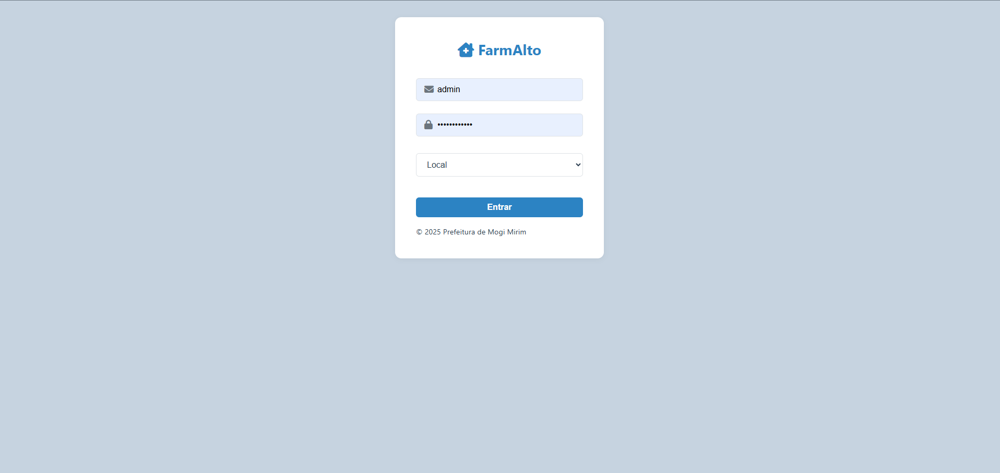
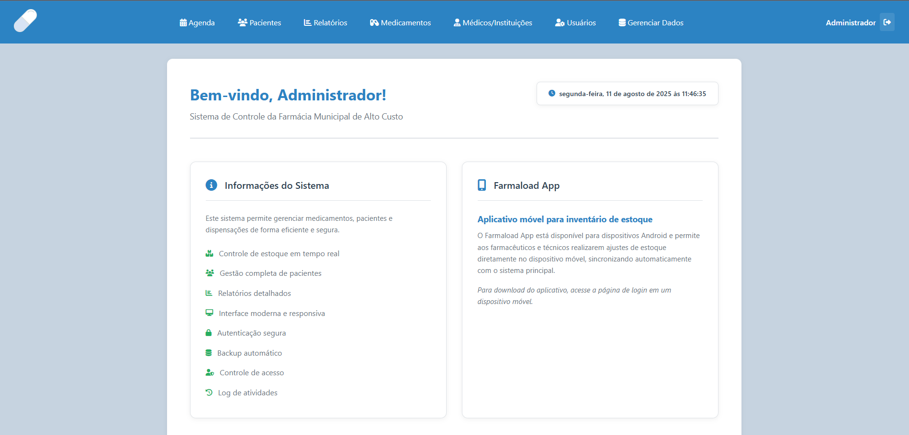
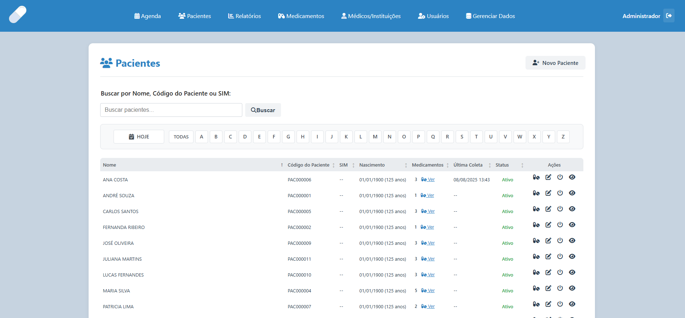
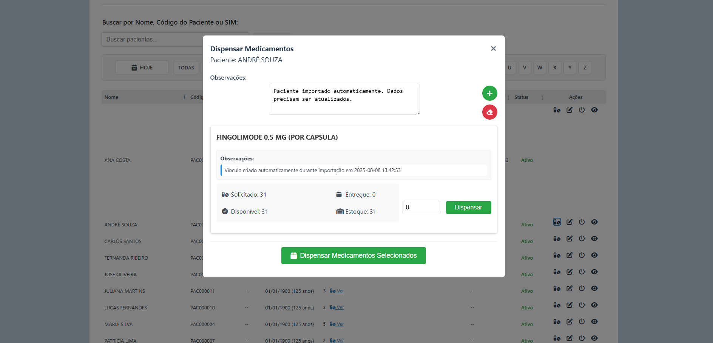
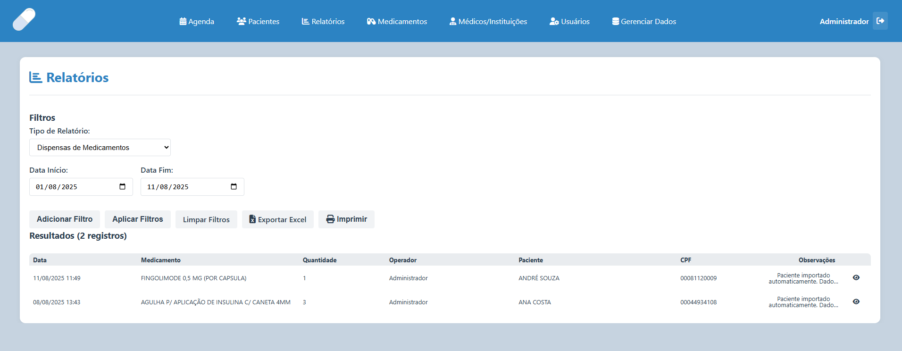
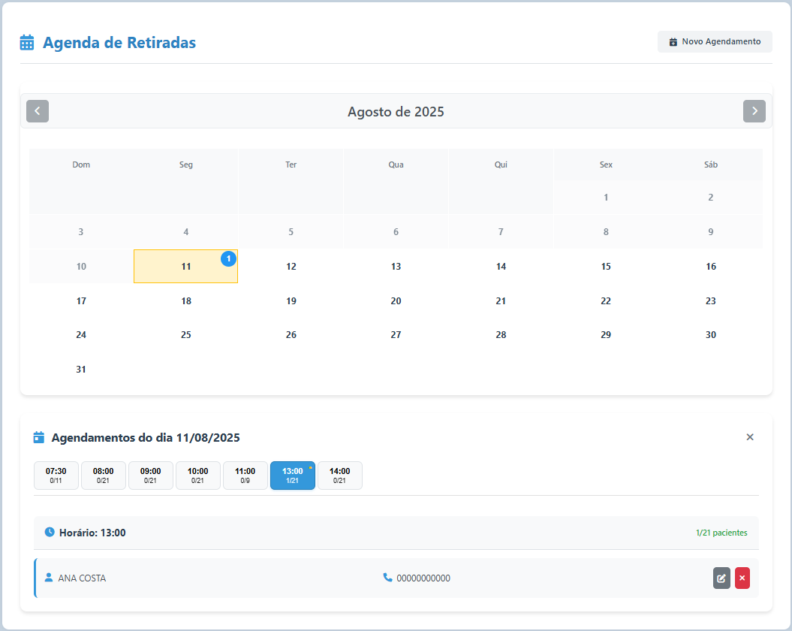

# 🏥 FARMALOAD - Sistema de Gerenciamento de Farmácia Pública de Alto Custo

<div align="center">


**Sistema completo para gestão de medicamentos de alto custo em farmácias públicas**

[](https://php.net)
[](https://mysql.com)
[](https://docker.com)
[](https://getbootstrap.com)

</div>

---

## 📋 Visão Geral do Sistema

O **FARMALOAD** é um sistema completo de gerenciamento desenvolvido especificamente para farmácias públicas que distribuem medicamentos de alto custo. O sistema oferece controle total sobre pacientes, medicamentos, dispensas, agendamentos e relatórios.

## 🏗️ Arquitetura Técnica

### **Backend**
- **PHP 8.0+** como linguagem principal
- **MySQL 8.0+** como banco de dados relacional
- **Apache/Nginx** como servidor web
- **Docker** para containerização
- **JWT** para autenticação segura

### **Frontend**
- **HTML5, CSS3, JavaScript (ES6+)**
- **Bootstrap 5.3** para interface responsiva
- **Font Awesome** para ícones
- **AJAX** para interações dinâmicas

## 🗄️ Estrutura do Banco de Dados

O sistema possui uma estrutura robusta com as principais tabelas:

- **`usuarios`** - Controle de acesso (admin/operador)
- **`pacientes`** - Cadastro completo com CPF, telefones, observações
- **`medicamentos`** - Catálogo com apresentações e códigos
- **`lotes_medicamentos`** - Controle de estoque por lote e validade
- **`paciente_medicamentos`** - Vinculação paciente-medicamento
- **`transacoes`** - Histórico de dispensas
- **`agenda`** - Sistema de agendamentos
- **`movimentacoes`** - Log de todas as movimentações de estoque

## ✨ Funcionalidades Principais

### **👥 Gestão de Pacientes**
- Cadastro completo com múltiplos telefones
- Sistema de códigos de paciente
- Controle de medicamentos por paciente
- Histórico médico detalhado
- Busca avançada por nome, CPF ou código
- Sistema de pessoas autorizadas para retirada

### **💊 Gestão de Medicamentos**
- Controle de estoque em tempo real
- Sistema de lotes com controle de validade
- Múltiplas apresentações (comprimidos, cápsulas, injetáveis, etc.)
- Alertas de vencimento
- Histórico completo de movimentações
- Triggers automáticos para atualização de quantidades

### **📅 Sistema de Agenda**
- Calendário interativo mensal
- Agendamento de retiradas com horários específicos
- Sistema de encaixes (até 21 pacientes por hora)
- Bloqueio de datas específicas
- Controle de status (agendado, confirmado, realizado, cancelado)

### **💉 Controle de Dispensas**
- Dispensa individual e múltipla
- Validação de períodos de renovação
- Sistema de extornos
- Controle por lotes específicos
- Observações detalhadas por dispensa

### **📊 Sistema de Relatórios**
- **Dispensas por período** com filtros avançados
- **Situação dos pacientes** (renovações, vencimentos)
- **Controle de estoque** atual e movimentações
- **Ajustes de estoque** com auditoria
- **Agendamentos** por período
- **Exportação para Excel** em todos os relatórios

### **🔄 Importação Automática**
- Suporte a múltiplos formatos (Excel, RELINI_FIM)
- Mapeamento automático de dados
- Validação inteligente de registros
- Logs detalhados de importação
- Sistema de backup automático

## 🔒 Segurança Implementada

- **Headers de segurança HTTP** (XSS, CSRF, Frame Options)
- **Autenticação JWT** com regeneração de sessões
- **Validação robusta** de entrada de dados
- **Proteção contra força bruta** com logs de tentativas
- **Senhas hasheadas** com bcrypt
- **Auditoria completa** de todas as operações

## 📱 Aplicativo Móvel

Inclui um aplicativo Android (versão 1.1.20) para:
- Controle de estoque offline
- Sincronização automática
- Relatórios de ajustes
- Interface intuitiva

## 🚀 Deployment

O sistema utiliza **Docker Compose** para facilitar a implantação:
- Container web com PHP/Apache
- Container MySQL
- Volumes persistentes para dados
- Configuração via variáveis de ambiente
- Acesso padrão na porta 9010

### Pré-requisitos
- Docker e Docker Compose instalados
- Git para clonar o repositório
- Mínimo 2GB de RAM disponível

1. **Clone o repositório**
```bash
git clone https://github.com/rafaelcavalheri/farmaload
cd farmaload
```

2. **Configure as variáveis de ambiente**
```bash
cp farmacia/DOCKER-FILES/.env.exemplo farmacia/DOCKER-FILES/.env
```

**⚠️ IMPORTANTE**: Você deve editar o arquivo `.env` criado e configurar as seguintes variáveis obrigatórias:

```bash
# Configurações do Banco de Dados
DB_USER=seu_usuario_mysql
DB_PASSWORD=sua_senha_mysql
MYSQL_ROOT_PASSWORD=senha_root_mysql
MYSQL_USER=seu_usuario_mysql
MYSQL_PASSWORD=sua_senha_mysql

# Chave secreta para JWT (gere uma chave aleatória segura)
JWT_SECRET_KEY=sua_chave_secreta_jwt_muito_segura

# Porta do servidor web (opcional, padrão: 9010)
WEB_PORT=9010
```

**Dica**: Para gerar uma chave JWT segura, você pode usar:
```bash
# No Linux/Mac
openssl rand -base64 32

# No Windows (PowerShell)
[System.Web.Security.Membership]::GeneratePassword(32, 0)
```

3. **Inicie os containers**
```bash
cd farmacia/DOCKER-FILES
docker-compose up -d
```

4. **Acesse o sistema**
```
http://localhost:9010
```

### Credenciais Padrão
- **Usuário**: admin
- **Senha**: HakETodLEfRe

## 🖼️ Demonstração

<div align="center">

### Login


### Página inicial


### Pacientes


### Dispensa de medicamentos


### Relatórios e Análises


### Agenda


</div>

## 📚 Documentação Adicional

- **[Manual de Instalação](README/README.md)** - Guia completo de instalação
- **[Sistema de Importação](README/README_IMPORTACAO.md)** - Como importar dados
- **[Manutenção de Lotes](README/README_MANUTENCAO_LOTES.md)** - Gestão de lotes
- **[Histórico de Versões](VERSION.md)** - Todas as versões e funcionalidades

---

<div align="center">

**O FARMALOAD é uma solução completa e robusta para gestão farmacêutica pública, com foco em segurança, auditoria e facilidade de uso, atendendo às necessidades específicas de farmácias de alto custo.**

</div>

## 📄 Licença e Código Aberto

### 🆓 Software Livre e Código Aberto

O **FARMALOAD** é um software de **código aberto** distribuído sob os termos que garantem as seguintes liberdades:

- ✅ **Liberdade de usar** - Você pode usar este software para qualquer propósito
- ✅ **Liberdade de estudar** - Você pode estudar como o programa funciona e adaptá-lo às suas necessidades
- ✅ **Liberdade de distribuir** - Você pode redistribuir cópias para ajudar outros
- ✅ **Liberdade de melhorar** - Você pode melhorar o programa e liberar suas melhorias para o público

### 🔄 Direitos de Modificação e Compartilhamento

#### **Modificação**
- Você tem o **direito total** de modificar o código-fonte conforme suas necessidades
- Pode adaptar o sistema para diferentes tipos de farmácias ou estabelecimentos de saúde
- É livre para adicionar novas funcionalidades, corrigir bugs ou melhorar a performance
- Pode personalizar a interface, relatórios e fluxos de trabalho

#### **Compartilhamento**
- Você pode **compartilhar livremente** o software original ou suas modificações
- É encorajado a contribuir com melhorias de volta para a comunidade
- Pode distribuir o sistema para outras instituições de saúde
- Não há restrições para uso comercial ou não-comercial

#### **Atribuição**
- Ao redistribuir, mantenha os créditos aos autores originais
- Inclua uma cópia desta licença em qualquer distribuição
- Documente as modificações realizadas quando aplicável

### 🤝 Contribuições da Comunidade

Encorajamos contribuições da comunidade através de:

- **Pull Requests** - Envie suas melhorias e correções
- **Issues** - Reporte bugs ou sugira novas funcionalidades  
- **Documentação** - Ajude a melhorar a documentação
- **Testes** - Contribua com testes e validações
- **Traduções** - Ajude a traduzir o sistema para outros idiomas

### ⚖️ Isenção de Responsabilidade

Este software é fornecido "como está", sem garantias de qualquer tipo. Os autores não se responsabilizam por danos decorrentes do uso deste software. É recomendado:

- Realizar testes adequados antes da implementação em produção
- Manter backups regulares dos dados
- Seguir as boas práticas de segurança e conformidade regulatória
- Validar o sistema conforme as normas locais de saúde

### 📞 Suporte e Comunidade

Para suporte, dúvidas ou contribuições:

- **Issues**: Reporte problemas através do GitHub Issues
- **Discussões**: Participe das discussões da comunidade

---

**💡 Lembre-se**: O código aberto prospera com a participação da comunidade. Suas contribuições, por menores que sejam, fazem a diferença!


